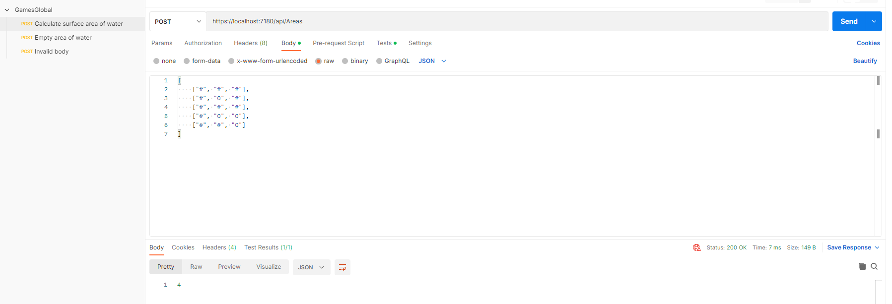
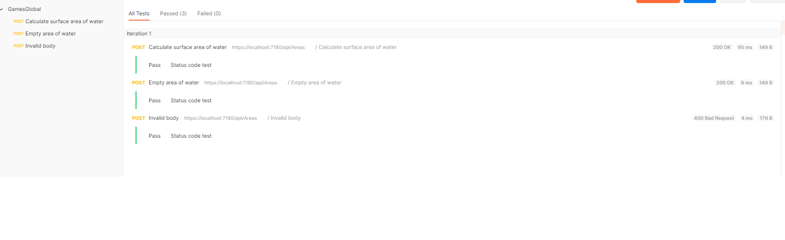

# Introduction
Your mission is to pinpoint the surface areas of water.

You have a map which describes the contents of each square meter of a geographical zone. One square meter is composed of either land or water.

Our program receives as input coordinates and the map and determine the
surface area of the lake which is located there. If there is no lake, then the surface area equals 0.

# Getting started

git clone https://github.com/strelokask/games-global.git

## Used technologies

- ASP.NET Core Web API (.net6)
- Postman
## Input values

The character **#** represents *land* and the letter **O** (uppercase) represents *water*. 

For example: 
|   |   |   |
|---|---|---|
| #  | # | # |
| #  | O | # |
| #  | # | # | 
| #  | O | O | 
| #  | # | O | 

the API should return 4

# Build and run
- mv GamesGlobal.Web.API > `dotnet run`

- You can import **GamesGlobal.postman_collection.json** and Run Collection to test API

